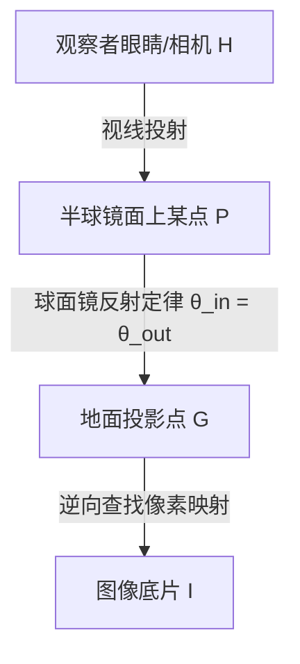

# 球面镜面反射逆向映射生成器 (Spherical Anamorphism GUI)

[](https://www.python.org/downloads/)
[](https://opensource.org/licenses/MIT)
[](https://opencv.org/)

这是一个基于 **Python + OpenCV + Tkinter** 实现的高精细度**球面镜面反射变形（Spherical Anamorphism）逆向映射生成工具**。 

该工具旨在帮助艺术家、设计师和物理科学爱好者将任何常规的二维图像或文字，通过高精度的几何光学公式反推，生成铺设在地面上的拉伸畸变图像。当在画面中心放置一颗等比尺寸的**球形镜面（如不锈钢装饰半球、反光水晶球）**时，观察者从正上方俯瞰即可在镜子中欣赏到完美还原、毫无畸变的图像或文字。

---

## 📸 核心特性与渲染模式

本生成器支持三大核心投影模式，以适配各种艺术形态和物理观测需求：

1. **360° 极坐标环绕模式 (Wrap)**
   - **特点**：图像呈 360 度圆环状平铺在球底周围。
   - **物理反射效果**：在半球镜中，画面会完美地平贴环绕在镜子的一周，非常适合用来制作环形文字徽章或展示全局全景画。
   
2. **前方单侧广告牌模式 (Billboard)**
   - **特点**：画面仅投影在半球镜面向观察者的单侧斜前方。
   - **物理反射效果**：镜中呈现一个立体的单面“广告牌”，背景呈半弧形包覆，立体感极强。

3. **中心圆盘徽章模式 (Disk)**
   - **特点**：专为圆形标志、同心圆文字或徽章图案而设计。
   - **物理反射效果**：在镜子的最外侧边缘或顶部，按原始圆形比例完美倒映图像，常用于定制礼品和趣味物理光学实验。

---

## 🔬 光学几何逆向物理原理

传统的变形艺术（Anamorphism）多采用圆柱镜，而球面镜（Spherical Mirror）的几何反射更为复杂。本软件采用基于第一性原理（First Principles）的高精度光线追踪逆向映射算法。

### 光路折返几何模型



### 核心数学流程
1. **建立物理网格**：在纸面/地面建立大小为 $2L \times 2L$ 的物理坐标系，每个网格点的坐标为 $G(X_g, Y_g)$。
2. **极坐标转换**：对地面上的每个像素点，计算它与镜面圆心的物理距离 $R_g = \sqrt{X_g^2 + Y_g^2}$ 以及方位角 $\Psi = \arctan2(Y_g, X_g)$。
3. **求解球面入射角 $\phi$**：根据半球镜面半径 $R$ 和相机高度 $H$，利用几何光路公式，通过插值算法反求出射光线所对应的球面镜入射角 $\phi$。
4. **反推源图像素位置**：通过 $\phi$ 反推该光线在相机传感器（即输入源图像）中的对应像素坐标 $(map\_x, map\_y)$。
5. **重投影插值**：利用 OpenCV 高效的 `cv2.remap` 渲染管线进行双线性插值，将原图像素高速、无锯齿地搬移到纸面。

---

## 🛠️ 软件界面与高级控制

软件设计了直观的交互界面，保证专业物理参数精度的同时提供了流畅的拖拽体验：

* **自适应双栏拉伸**：左侧控制栏永不被压缩，右侧双画布（原始图对比、纸面扭曲图）支持随窗口缩放自适应大小。
* **高精度物理参数滑块+微调框**：
  - **相机高度 ($H$)**：调节观察者眼睛/相机距离桌面的垂直高度。
  - **镜面半径 ($R$)**：调整您购买的物理反光半球体半径。
  - **投影半径 ($L$)**：确定要打印的纸面半边长大小。
* **高精度物理对准辅助线**：
  - **半球底座边界参考线**：直接在生成的图片中心绘制与半球镜等尺寸的圆，打印后将半球正对准该圆放上即可。
  - **多重自定义同心圆**：在界面中输入逗号隔开的物理半径（例如 `300, 500`），即可在纸面上生成对应的多重灰色高精度同心辅助圆，帮助在物理现场极速对齐。
* **精细化位移和缩放**：
  - 支持画面的缩放以及在镜面中反射位置的 $X$、$Y$ 水平与垂直偏移调节，帮助您完美摆放反射画面。
* **保留 Alpha 透明通道**：完美支持 PNG 透明背景图片，生成透明底的变形图，可直接叠加在任何纸张或画布纹理上印刷。

---

## 🚀 极速上手

### 1. 安装依赖

本项目基于常规的 Python 环境，只需安装 `numpy`, `opencv-python` 以及 `pillow` (PIL) 库。

```bash
pip install numpy opencv-python pillow
```

### 2. 运行程序

在终端或命令行中直接运行主入口文件 `main.py` 启动 GUI：

```bash
python main.py
```

### 3. 操作指引

1. **选择输入**：您可以直接在左上角输入想要测试的文本（支持中英文，回车或点击“渲染文字”生效），或者点击“**选择本地图片**”上传您的 PNG 标志、手绘插画等。
2. **调节物理参数**：
   - 测量或估算您要进行的实验物理参数（如您的半球镜半径、拍摄照片时手机相机到桌面的距离）。
   - 根据实际需求调整滑块。建议开启“**启用实时拖动预览**”以获得即时视觉回馈。
3. **设置辅助线**：在“映射投影配置”中，配置您想要的同心辅助圆，这对于后续打印物理实验极其关键。
4. **导出高清图像**：点击“**导出高清印刷图片...**”，即可使用高精度完整像素运行逆向追踪，并保存为高清大图。

---

## 🎨 物理打印与动手实验指南

要想在现实中完美体验该球面反射艺术，只需按以下步骤操作：

1. **准备半球反射镜**：在网购平台（如淘宝、Amazon）搜索“不锈钢镜面半球”或“装饰用镜面金属半球”，购买一颗反射效果良好的金属半球（例如半径 $R = 50\text{mm}$ 的半球）。
2. **计算并生成**：在软件中输入半球的真实半径（如 $50$）以及您预估的相机拍照高度（如 $300$），生成并保存高清图。
3. **等比打印**：使用纸张（建议使用硬质卡纸或高光相纸）将导出的扭曲图**按真实比例（如 $1:1$）**打印出来。
4. **放置与观察**：
   - 将打印出的纸张水平放置在桌面上。
   - 将购买的金属半球，**严格对准图像中心**的白色圆形边界放置。
   - 拿出手机，将手机镜头放置在参数中设置的高度（如中心正上方 $300\text{mm}$ 处）向下拍照或观察。
   - 此时，您将在半球镜面中看到一幅原本扭曲的图片被“魔法般地”还原成没有丝毫畸变的完美图像！

---

## 📄 开源协议

本项目基于 **MIT License** 开源。您可以自由地修改、分发及商用。
欢迎在此基础上开发更具创意的光学艺术衍生工具！
